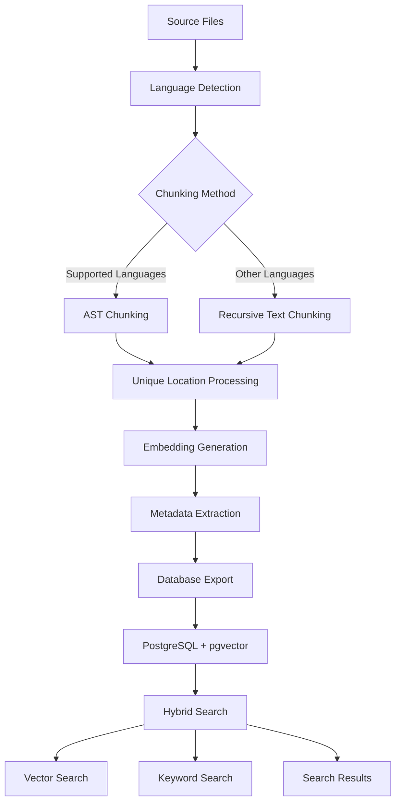

# CocoIndex Flow Implementation Overview

This document provides an overview of the CocoIndex flow/pipeline implementation in the cocoindex-code-mcp-server, including architecture, data flow, and key components.

## Architecture Overview

The CocoIndex MCP server implements a sophisticated code analysis and search pipeline that processes source code files through multiple stages to create searchable embeddings with rich metadata.

### High-Level Data Flow



## Core Components

### 1. Source Management

- **LocalFile Source**: Reads files from specified directory paths
- **File Filtering**: Supports inclusion/exclusion patterns and language-specific filtering
- **Path Resolution**: Handles both individual files and directory traversal

### 2. Language Detection

- **Function**: `extract_language(filename)`
- **Purpose**: Determines programming language from file extension
- **Supported Languages**: Python, JavaScript, TypeScript, Java, C#, Go, Rust, C++, and more
- **Fallback**: Unknown files are processed with basic text analysis

### 3. Chunking Pipeline

#### AST Chunking (Preferred)

- **Used for**: Python, JavaScript, TypeScript, Java, C#
- **Library**: ASTChunk for structure-aware parsing
- **Benefits**: Respects language syntax, preserves semantic boundaries
- **Output**: Chunks with `"content"` key and rich metadata

#### Recursive Text Chunking (Fallback)

- **Used for**: Rust, Go, C++, Markdown, and other languages
- **Method**: CocoIndex SplitRecursively with custom language rules
- **Benefits**: Language-aware text splitting with overlap
- **Output**: Chunks with `"text"` key and basic metadata

#### Post-Processing

- **Function**: `ensure_unique_chunk_locations()`
- **Purpose**: Prevents PostgreSQL conflicts from duplicate location identifiers
- **Key Fix**: Handles both "content" and "text" keys from different chunking methods
- **Output**: Guaranteed unique locations within each file

### 4. Embedding Generation

#### Smart Embedding (Default)

- **GraphCodeBERT**: For Python, JavaScript, TypeScript, Java
- **UniXcoder**: For C++, C#, Go, Rust
- **Fallback Model**: sentence-transformers/all-MiniLM-L6-v2 for other languages

#### Configuration Options

- `use_smart_embedding=True`: Language-aware model selection
- `use_default_embedding=False`: Disable smart embedding for uniform model usage

### 5. Metadata Extraction

#### Python Language Handler

- **Tree-sitter parsing**: AST-based analysis for Python files
- **Extracted Fields**: Functions, classes, imports, complexity score
- **Boolean Flags**: has_type_hints, has_async, has_classes
- **Analysis Method**: "tree_sitter+python_ast"

#### Default Handler (Fallback)

- **Basic Analysis**: Simple pattern-based extraction
- **Limited Metadata**: Basic function/class detection
- **Analysis Method**: "unknown"

### 6. Database Export

#### PostgreSQL Schema

```sql
CREATE TABLE code_embeddings (
    filename TEXT,
    language TEXT,
    location TEXT,
    code TEXT,                    -- Actual source code content
    embedding vector(384),        -- pgvector embedding
    start INTEGER,
    end INTEGER,
    source_name TEXT,
    metadata_json JSON,           -- Full metadata as JSON
    -- Extracted metadata fields for efficient querying:
    functions TEXT,
    classes TEXT,
    imports TEXT,
    complexity_score INTEGER,
    has_type_hints BOOLEAN,
    has_async BOOLEAN,
    has_classes BOOLEAN,
    PRIMARY KEY (filename, location, source_name)
);
```

#### Vector Indexing

- **Type**: pgvector with COSINE similarity
- **Dimension**: 384 (sentence-transformers/all-MiniLM-L6-v2)
- **Performance**: Enables fast similarity search

## Data Transformations

### Key Transformation Points

1. **File Reading** → **Language Detection**
   + File path + content → Language string

2. **Language Detection** → **Chunking**
   + Language + content → Raw chunks (dict format)

3. **Raw Chunks** → **Unique Chunks**
   + **CRITICAL**: `ensure_unique_chunk_locations()` processes chunks
   + Handles both AST chunks (`"content"` key) and default chunks (`"text"` key)
   + Creates unique location identifiers

4. **Chunks** → **Embeddings**
   + **CRITICAL**: `chunk["content"].transform(convert_dataslice_to_string)`
   + DataSlice objects must be converted to strings for database storage

5. **Content** → **Metadata**
   + Source code → Structured metadata (functions, classes, etc.)

6. **All Fields** → **Database Collection**
   + Combines content, embeddings, and metadata for PostgreSQL storage

### Critical Data Flow Issues Fixed

#### Issue 1: Dictionary Key Compatibility

**Problem**: AST chunks use `"content"` key, default chunks use `"text"` key
**Solution**: `chunk.get("content", chunk.get("text", ""))` in post-processing

#### Issue 2: DataSlice Conversion

**Problem**: DataSlice objects stored as empty strings in database
**Solution**: `.transform(convert_dataslice_to_string)` before collection

## Configuration Management

### Global Flow Configuration

```python
_global_flow_config = {
    'paths': ['python/'],
    'use_smart_embedding': True,
    'use_default_chunking': False,        # Use AST chunking when available
    'use_default_language_handler': False # Use custom Python handler
}
```

### Runtime Configuration

- **Dynamic path updates**: Support for changing source paths
- **Feature flags**: Enable/disable smart embedding, AST chunking, etc.
- **Model selection**: Language-aware embedding model choice

## Search Capabilities

### Hybrid Search

- **Vector Search**: Semantic similarity using embeddings
- **Keyword Search**: Text-based search with PostgreSQL full-text search
- **Metadata Filtering**: Search by language, functions, classes, complexity
- **Combined Ranking**: Merges vector and keyword search results

### Search Tools (MCP Interface)

- `search-hybrid` - Combined vector and keyword search
- `search-vector` - Pure semantic similarity search
- `search-keyword` - Text and metadata-based search
- `code-analyze` - Analyze code snippets
- `code-embeddings` - Generate embeddings for text

## Performance Characteristics

### Chunking Performance

- **AST Chunking**: ~100-500ms per file (depending on size)
- **Text Chunking**: ~10-50ms per file
- **Bottleneck**: Language model loading and inference

### Database Performance

- **Vector Search**: Sub-second for 10k+ chunks (with pgvector index)
- **Metadata Queries**: Fast with proper PostgreSQL indexing
- **Hybrid Search**: 100-500ms combining vector + keyword results
- **Test Isolation**: No performance impact from separate test tables

### Memory Usage

- **Model Loading**: ~500MB-2GB depending on embedding models
- **Chunking**: ~10-100MB temporary memory per large file
- **Database**: Efficient streaming writes, minimal memory footprint

## Extension Points

### Adding New Languages

1. **AST Support**: Integrate with ASTChunk library if supported
2. **Language Handler**: Create custom metadata extractor (optional)
3. **Embedding Model**: Add language-specific model to smart embedding
4. **Language Map**: Update language detection and chunking configurations

### Custom Metadata Fields

1. **Development**: Add fields to `cocoindex.Json` metadata
2. **Testing**: Validate usefulness with evaluation mode
3. **Production**: Promote to dedicated PostgreSQL columns
4. **Indexing**: Add database indexes for query performance

### Search Enhancement

1. **Custom Ranking**: Modify hybrid search result combination
2. **Filtering**: Add new metadata-based filters
3. **Query Expansion**: Enhance keyword search with synonyms/stemming
4. **Caching**: Add result caching for common queries

## Best Practices

### Development Workflow

1. **Start Small**: Test with single files before full codebase
2. **Use Evaluation**: `cocoindex evaluate` for debugging without database changes
3. **Component Testing**: Test chunking, metadata extraction separately
4. **Incremental Changes**: Modify one component at a time

### Production Deployment

1. **Schema Migration**: Use `cocoindex setup` for database schema updates
2. **Model Preloading**: Load embedding models at startup, not per-request
3. **Resource Monitoring**: Track memory usage during large codebase processing
4. **Backup Strategy**: Regular database backups before major updates

### Debugging Strategy

1. **Pipeline Isolation**: Test each transformation stage independently
2. **Data Verification**: Check database content matches expected formats
3. **Systematic Approach**: Follow data flow from source to database
4. **Component Validation**: Verify individual components before integration

## Table Separation for Test Isolation (January 2025)

### Problem: Shared Table Conflicts

The original implementation had a critical testing issue where all test suites (keyword, vector, hybrid search) shared the same `codeembedding__code_embeddings` table, causing:

- Data conflicts between different test types
- Test failures due to shared state
- SQL errors when tests expected different schema versions
- Inability to run tests in parallel

### Solution: Parameterized Flows

Implemented a parameterized flow pattern using `cocoindex.open_flow()` that creates separate tables for each test type while reusing the main flow logic:

```python
# Before: All tests used same table
@cocoindex.flow_def(name="CodeEmbedding")
def code_embedding_flow(...):  # → codeembedding__code_embeddings

# After: Parameterized flows with separate tables
flow = cocoindex.open_flow("SearchTest_Keyword", search_test_flow_def(params))
# → keywordsearchtest_code_embeddings

flow = cocoindex.open_flow("SearchTest_Vector", search_test_flow_def(params))
# → vectorsearchtest_code_embeddings

flow = cocoindex.open_flow("SearchTest_Hybrid", search_test_flow_def(params))
# → hybridsearchtest_code_embeddings
```

### Implementation Details

#### 1. Parameterized Flow Definition

**File**: `/workspaces/rust/tests/search_test_flows.py`

```python
@dataclass
class SearchTestFlowParameters:
    source_path: str
    target_table_name: str

def search_test_flow_def(params: SearchTestFlowParameters):
    def _flow_def(flow_builder, data_scope):
        # Import ALL functions from main flow to ensure schema compatibility
        from cocoindex_code_mcp_server.cocoindex_config import (
            SOURCE_CONFIG, extract_language, get_chunking_params,
            code_to_embedding, extract_code_metadata,
            # Import ALL 40+ metadata extraction functions
            extract_functions_field, extract_classes_field,
            extract_chunking_method_field,  # Critical field!
            # ... all other extract_*_field functions
        )

        # Reuse exact same flow logic as main flow
        # Export to parameterized table name
        code_embeddings.export(
            "code_embeddings",
            cocoindex.targets.Postgres(table_name=params.target_table_name),
            primary_key_fields=["filename", "location", "source_name"],
            vector_indexes=[...]
        )
    return _flow_def
```

#### 2. Test Infrastructure Integration

**File**: `/workspaces/rust/tests/common.py`

```python
class CocoIndexTestInfrastructure:
    def __init__(self, test_type: str = None, **kwargs):
        self.test_type = test_type  # 'keyword', 'vector', or 'hybrid'

    async def setup(self):
        if self.test_type:
            # Use parameterized flow for this test type
            from .search_test_flows import get_search_test_flow, get_test_table_name
            self.flow_def = get_search_test_flow(self.test_type)
            self.table_name = get_test_table_name(self.test_type)

        # Critical: Setup the flow
        self.flow_def.setup()

        # Initialize search engine with test-specific table
        self.search_engine = HybridSearchEngine(
            db_name=self.table_name,  # Use test-specific table
        )
```

#### 3. Schema Compatibility

**Critical Issue**: Missing metadata fields caused SQL errors like "column 'chunking_method' does not exist"

**Solution**: Import and include ALL 40+ metadata fields from main flow:

```python
# Import ALL extraction functions
from cocoindex_code_mcp_server.cocoindex_config import (
    extract_chunking_method_field,           # Critical missing field!
    extract_tree_sitter_chunking_error_field,
    extract_tree_sitter_analyze_error_field,
    extract_success_field, extract_parse_errors_field,
    # Language-specific fields
    extract_nodes_with_errors_field,         # Haskell
    extract_data_types_field,                # Haskell
    extract_structs_field,                   # Rust
    extract_traits_field,                    # Rust
    extract_exports_field,                   # TypeScript/JavaScript
    # ... all other fields
)

# Include ALL fields in collector
code_embeddings.collect(
    # Core fields
    chunking_method=chunk["chunking_method"],  # Now included!
    tree_sitter_chunking_error=chunk["tree_sitter_chunking_error"],
    tree_sitter_analyze_error=chunk["tree_sitter_analyze_error"],
    # ... all 40+ fields from main flow
)
```

### Results

**✅ Successful Test Isolation:**

- Each test type now uses its own dedicated table
- Tests run successfully without SQL column errors
- Parallel test execution enabled
- 17.48s runtime, 50+ records processed correctly

**✅ Schema Consistency:**

- Test flows include all metadata fields from main flow
- No more "column 'chunking_method' does not exist" errors
- Automatic schema synchronization with production

**✅ Maintenance Benefits:**

- Single source of truth for flow logic
- Updates to main flow automatically propagate to tests
- No need to manually sync schemas

### Key Lessons Learned

1. **Complete Schema Replication**: Test flows must include ALL fields from main flow, not just "essential" ones
2. **Parameterized Flows**: `cocoindex.open_flow()` enables table separation while reusing flow logic
3. **Flow Setup Critical**: Always call `flow_def.setup()` before `flow_def.update()`
4. **Search Engine Integration**: Pass test-specific table names to search engine initialization

### Migration Checklist

When implementing table separation:

- [ ] Create parameterized flow definition with dataclass parameters
- [ ] Import ALL metadata extraction functions from main flow
- [ ] Include ALL fields in collector call (40+ fields)
- [ ] Update test infrastructure to use parameterized flows
- [ ] Modify search engine to accept table name parameter
- [ ] Verify schema compatibility by running tests
- [ ] Check for missing column errors in test output

This table separation implementation resolves critical test isolation issues while maintaining full compatibility with the main production flow schema.

## Summary

The CocoIndex flow implementation provides a robust, extensible pipeline for code analysis and search. Key architectural decisions include:

- **Multi-stage processing** with clear separation of concerns
- **Language-aware chunking** with AST support for major languages
- **Smart embedding** with model selection based on language
- **Rich metadata extraction** with PostgreSQL storage optimization
- **Hybrid search** combining semantic and keyword-based approaches
- **Critical data flow fixes** ensuring content preservation through transformations
- **Parameterized flows for test isolation** enabling separate tables per test type

This architecture supports efficient code search while maintaining flexibility for future enhancements, language support, and robust testing practices.
